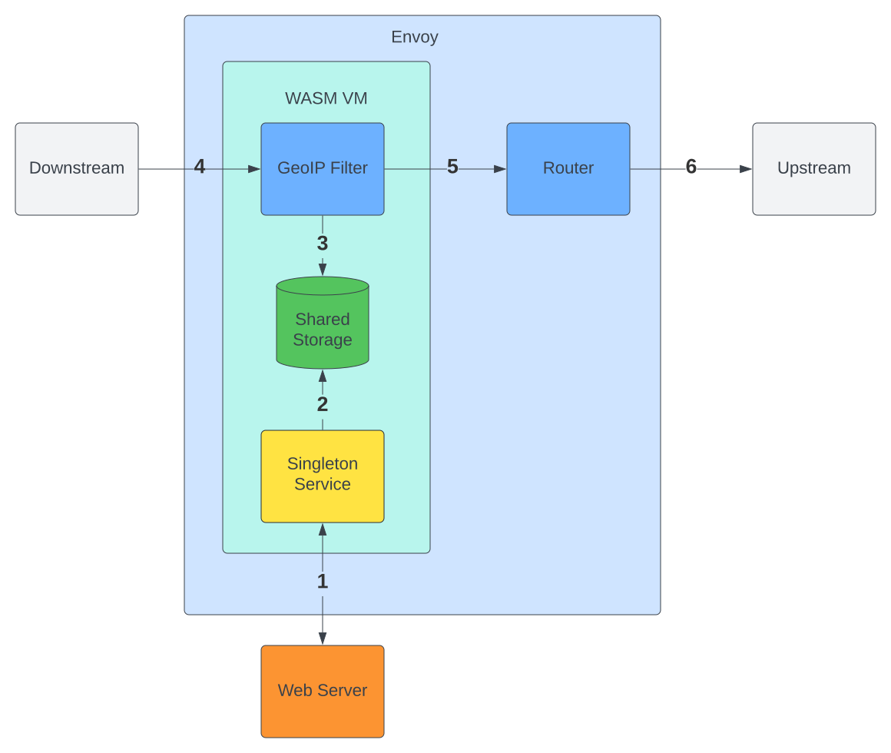

# geoip-filter
WASM filter for Envoy that adds GeoIP data to HTTP requests

## Flow


1. On start of WASM VM the singleton service fetches the MaxMind DB from the web server.
2. Singleton service persists MaxMind DB to WASM VM shared storage.
3. Each worker thread's GeoIP Filter process loads the MaxMind DB from shared storage when it's available and uses it to initialize a MaxMind Reader.
4. Incoming request from downstream is intercepted by GeoIP Filter in filter chain.  GeoIP Filter uses Reader to lookup geoip data of request IP and append's geoip data to request headers.
5. GeoIP Filter signals Envoy to continue processing request down filter chain.
6. Router filter routes request to correct upstream.

## TODO

* Clean up (error handling, logging, refresh of mmdb, race conditions)
* Handle XFF appropriately
* Allow customization of request header that source IP is extracted from. Currently, limited to first IP in XFF header.
* Allow customization of request header geoip data is injected into. Currently, limited to `x-country-code`.
* Allow customization of geoip data that is resolved. Currently, limited to Country Code of source IP.
* Benchmark and compare to [external processor](https://github.com/mburtless/geoip-processor) solution.

## Building

Install the wasm compiler into the rust toolchain.
```shell
rustup update
rustup rustup target add wasm32-unknown-unknown
```
Build the binaries for both the singleton service and the GeoIP Filter
```shell
make build
```

## Testing

In order to test this, you must have the MaxMind [GeoLite2](http://dev.maxmind.com/geoip/geoip2/geolite2/) or
[GeoIP2](http://www.maxmind.com/en/geolocation_landing) mmdb present locally.  This project is currently hardcoded 
to use country DB.

```shell
# bring up Envoy, httpbin and webserver hosting GeoLite2 mmdb
make run

# test via httpbin. Spoof IP by manually setting XFF header and note x-country-code in response
# US IP
$ curl -H "X-Forwarded-For: 8.8.8.8" 127.0.0.1:10000/headers
{
  "headers": {
    "Accept": "*/*",
    "Host": "127.0.0.1:10000",
    "User-Agent": "curl/7.79.1",
    "X-Country-Code": "US",
    "X-Envoy-Expected-Rq-Timeout-Ms": "15000"
  }
}

# Indian IP
$ curl -H "X-Forwarded-For: 3.6.203.25" 127.0.0.1:10000/headers
{
  "headers": {
    "Accept": "*/*",
    "Host": "127.0.0.1:10000",
    "User-Agent": "curl/7.79.1",
    "X-Country-Code": "IN",
    "X-Envoy-Expected-Rq-Timeout-Ms": "15000"
  }
}

# Australian IP
$ curl -H "X-Forwarded-For: 13.210.4.1" 127.0.0.1:10000/headers
{
  "headers": {
    "Accept": "*/*",
    "Host": "127.0.0.1:10000",
    "User-Agent": "curl/7.79.1",
    "X-Country-Code": "AU",
    "X-Envoy-Expected-Rq-Timeout-Ms": "15000"
  }
}
```
